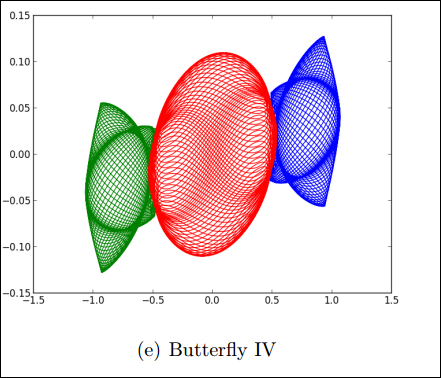
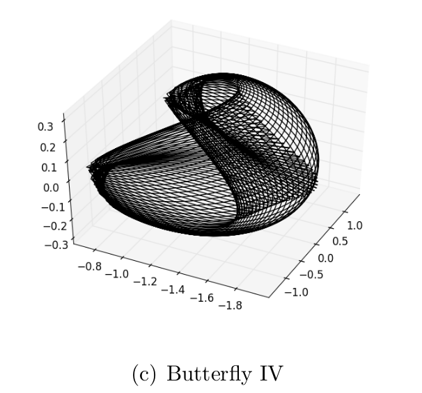

Computational-Physics
=====================

Selected reports:

- [Recently Discovered Periodic Solutions to the Three-Body Problem](final_project/writeups/writeup.pdf)
- [The FFT and Spectral Methods](hw10/writeup.pdf)
- [Boundary Value Problems and Relaxation](hw6/writeup.pdf)
- [Ordinary Differential Equations and Chaotic Systems](hw4/writeup.pdf)
- [Time Dependent Schrodinger Equation](hw7/writeup.pdf)
